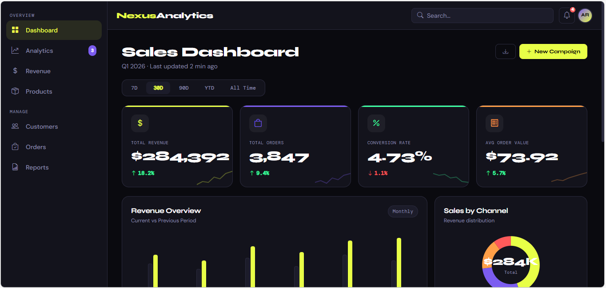
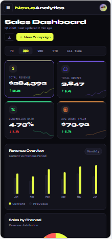
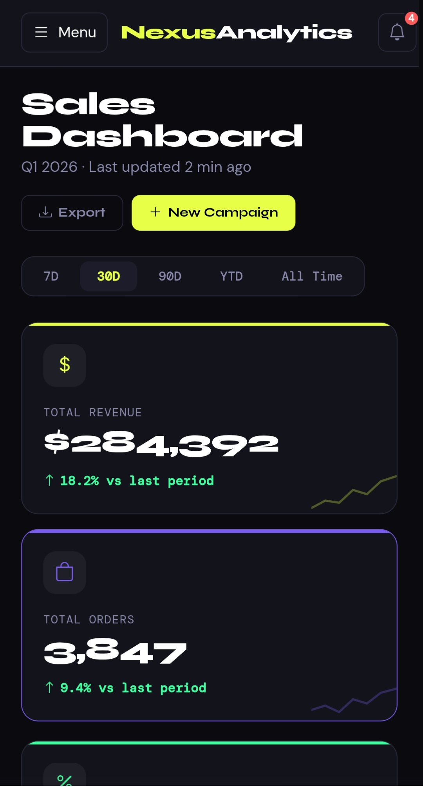
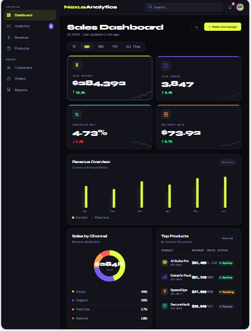

<div align="center">

```
███╗   ██╗███████╗██╗  ██╗██╗   ██╗███████╗
████╗  ██║██╔════╝╚██╗██╔╝██║   ██║██╔════╝
██╔██╗ ██║█████╗   ╚███╔╝ ██║   ██║███████╗
██║╚██╗██║██╔══╝   ██╔██╗ ██║   ██║╚════██║
██║ ╚████║███████╗██╔╝ ██╗╚██████╔╝███████║
╚═╝  ╚═══╝╚══════╝╚═╝  ╚═╝ ╚═════╝ ╚══════╝
     A N A L Y T I C S  —  D A S H B O A R D
```

# Advanced UI Implementation

**Laboratory Activity 2 — CSS Grid · Accessibility · Keyboard Navigation · Device Simulation**

<br/>


<br/>

> *A fully responsive, accessible, keyboard-navigable Analytics & Sales Dashboard built with a mobile-first approach dark mode, lime accent, clean grid.*

<br/>

</div>

---

## About the Project

**NexusAnalytics** is a complex, production-grade **Sales & Analytics Dashboard UI** built as the deliverable for *Laboratory Activity 2: Advanced UI Implementation*. The project demonstrates mastery of four core front-end concepts:

| Requirement | Implementation |
|---|---|
| **CSS Grid Layout** | Mobile-first multi-area dashboard grid that collapses to single-column on small screens |
| *Accessibility Audit** | WCAG AA/AAA contrast ratios, full ARIA labeling, semantic HTML, live regions |
| **Keyboard Navigation** | Every interactive element reachable via `Tab`, activatable via `Enter` / `Space` |
| **Device Simulation** | Tested and documented across 6 device profiles using Chrome DevTools |

The UI features a **dark theme** (`#0a0a0f` background) with a **lime-yellow accent** (`#e8ff47`), custom typography using `Syne` + `DM Sans` + `DM Mono`, and data-driven components powered by Alpine.js.

<br/>

---

## Live Preview

<div align="center">

### Desktop View — 1440px



<br/>

### Mobile View — 430px (iPhone 14 Pro Max)
 
  

### Mobile View — 360px (Infinix Hot 50 Pro Plus)
 
  

### Ipad View — 1024px (Ipad Pro)
 
    
</div>

<br/>

---

## Features

- **KPI Cards** — Total Revenue, Orders, Conversion Rate, Avg Order Value with sparkline SVGs and delta indicators
- **Revenue Bar Chart** — Pure CSS bars comparing current vs previous period across 6 months
- **Donut Chart** — SVG-based sales breakdown by channel (Direct, Organic, Paid, Referral)
- **Top Products Table** — Scrollable data table with status pills (Active / Pending / Paused)
- **Activity Feed** — Live-style event log with timestamped entries
- **Toast Notifications** — ARIA live region announcements for all interactions
- **Off-Canvas Sidebar** — Mobile slide-in nav with overlay, ESC key close, focus trap
- **Dark Theme** — Full dark palette with `#e8ff47` lime accent, `#7b5cf0` violet secondary
- **Date Range Tabs** — Toggle filter with `aria-pressed` state management
- **Search Bar** — Accessible search input with `role="search"`
- **Skip Link** — First tab stop jumps directly to main content

<br/>

---

## Tech Stack

| Layer | Technology | Purpose |
|---|---|---|
| **Markup** | HTML5 | Semantic structure, ARIA roles |
| **Styling** | CSS3 | Custom properties, animations, scrollbar |
| **Layout** | Tailwind CSS v3 (CDN) | Utility-first responsive grid & spacing |
| **Icons** | Bootstrap Icons v1.11 (CDN) | Crisp vector icon set |
| **Reactivity** | Alpine.js v3 (CDN) | Declarative JS sidebar, tabs, toasts, loops |
| **Typography** | Google Fonts | Syne · DM Sans · DM Mono |
| **Charts** | Pure SVG + CSS | Zero-dependency bar & donut charts |

> **No build tools. No npm. No frameworks.** Just one `.html` file and three CDN scripts.

<br/>

---

##  Getting Started

No installation, no build step, no dependencies to install locally.

### 1. Clone the Repository
First, copy the repository link, then run this command in your terminal:

```bash
git clone https://github.com/philipetorma/Advance-UI.git

After cloning, go inside the project folder:

cd Advance-UI
```

### 2. Make Changes
You can now open the project in your preferred code editor (e.g., VS Code) and start editing files.

### 3. Add Changes
After making changes, you need to stage them:
```bash
git add .
```

### 4. Commit Changes
Save your changes with a message:
```bash
git commit -m "Your message here"
```

### 5. Push to GitHub
end your changes to the repository:
```bash
git push origin main
```
Note: If your branch is not main, replace main with your branch name.

<br/>

---

##  Device Simulation & Testing

Tested using **Chrome DevTools → Device Toolbar** (`Ctrl+Shift+M` / `Cmd+Shift+M`).

### Breakpoint Reference

| Device | Viewport | Layout Behavior |
|---|---|---|
| **iPhone SE** | `375 × 667` | Single column · Hamburger nav · Sidebar hidden |
| **iPhone 14 Pro** | `393 × 852` | Single column · Hamburger nav · Search bar visible |
| **iPad Mini** | `768 × 1024` | Sidebar appears · 2-col KPI grid · 2-col dash |
| **iPad Pro** | `1024 × 1366` | Sidebar pinned · Wider layout · Full table |
| **Laptop** | `1280 × 800` | 4-col KPI · Optimized chart/table split |
| **Desktop** | `1440 × 900` | Full layout · Max comfortable reading width |


####  iPad Pro — 1024px
```
Same as iPad Mini but with more breathing room.
Sidebar feels less cramped. Table shows all columns.
Chart bars wider and more readable.
```

####  Desktop — 1440px
```
KPI cards: 4-col row.
Dashboard: 2fr + 1fr split (revenue chart large left,
donut compact right). Table + activity below.
Full search bar in header. All nav labels visible.
```

<br/>

---

## Authors

<div align="center">

| Name                       | Role             | GitHub                                                                 |
| -------------------------- | ---------------- | ---------------------------------------------------------------------- |
| **Philip Etorma**          | Owner | [@philipetorma](https://github.com/philipetorma)                       |
| **Jayson Simbajon**        | Contributor      | [@jaysonsimbajon6-byte](https://github.com/jaysonsimbajon6-byte)       |
| **Kristine Jane Tagadiad** | Contributor      | [@Kristinejanetagadiad](https://github.com/Kristinejanetagadiad)       |
| **Jacqueline Espina**      | Contributor      | [@jacquelineespina371-rgb](https://github.com/jacquelineespina371-rgb) |
| **John Kenneth Gaviola**   | Contributor      | [@Kenneth30222](https://github.com/Kenneth30222)                       |

</div>

<br/>
*Submitted for **Laboratory Activity 2 — Advanced UI Implementation***
<br/>
---


## Acknowledgements

- [Tailwind CSS](https://tailwindcss.com/) — Utility-first CSS framework
- [Bootstrap Icons](https://icons.getbootstrap.com/) — Open source icon library
- [Alpine.js](https://alpinejs.dev/) — Lightweight JS reactivity
- [Google Fonts](https://fonts.google.com/) — Syne, DM Sans, DM Mono typefaces
- [Shields.io](https://shields.io/) — README badge generator
- [Chrome DevTools](https://developer.chrome.com/docs/devtools/) — Lighthouse audit & device simulation

<br/>

---
